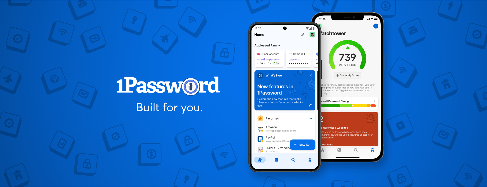

<div align="center">

[](https://1password.com)

# 1password<a id="1password"></a>

REST API interface for 1Password Connect.


</div>

## Table of Contents<a id="table-of-contents"></a>

<!-- toc -->

- [Requirements](#requirements)
- [Installation](#installation)
- [Getting Started](#getting-started)
- [Async](#async)
- [Raw HTTP Response](#raw-http-response)
- [Reference](#reference)
  * [`onepasswordconnect.activity.get_api_requests`](#onepasswordconnectactivityget_api_requests)
  * [`onepasswordconnect.files.get_all_files_inside_item`](#onepasswordconnectfilesget_all_files_inside_item)
  * [`onepasswordconnect.files.get_content`](#onepasswordconnectfilesget_content)
  * [`onepasswordconnect.files.get_file_details`](#onepasswordconnectfilesget_file_details)
  * [`onepasswordconnect.health.check_liveness`](#onepasswordconnecthealthcheck_liveness)
  * [`onepasswordconnect.health.server_state_check`](#onepasswordconnecthealthserver_state_check)
  * [`onepasswordconnect.items.create_new_item`](#onepasswordconnectitemscreate_new_item)
  * [`onepasswordconnect.items.delete_item_by_id`](#onepasswordconnectitemsdelete_item_by_id)
  * [`onepasswordconnect.items.get_all`](#onepasswordconnectitemsget_all)
  * [`onepasswordconnect.items.get_details_by_id`](#onepasswordconnectitemsget_details_by_id)
  * [`onepasswordconnect.items.update_item_details`](#onepasswordconnectitemsupdate_item_details)
  * [`onepasswordconnect.items.update_subset_attributes`](#onepasswordconnectitemsupdate_subset_attributes)
  * [`onepasswordconnect.metrics.query_server_metrics`](#onepasswordconnectmetricsquery_server_metrics)
  * [`onepasswordconnect.vaults.get_details`](#onepasswordconnectvaultsget_details)
  * [`onepasswordconnect.vaults.list_all`](#onepasswordconnectvaultslist_all)

<!-- tocstop -->

## Requirements<a id="requirements"></a>

Python >=3.7

## Installation<a id="installation"></a>
<div align="center">
  <a href="https://konfigthis.com/sdk-sign-up?company=1Password&serviceName=Connect&language=Python">
    
  </a>
</div>

## Getting Started<a id="getting-started"></a>

```python
from pprint import pprint
from 1_password_connect_python_sdk import OnePasswordConnect, ApiException

onepasswordconnect = OnePasswordConnect(

    access_token = 'YOUR_BEARER_TOKEN'
)

try:
    # Retrieve a list of API Requests that have been made.
    get_api_requests_response = onepasswordconnect.activity.get_api_requests(
        limit=10,
        offset=50,
    )
    print(get_api_requests_response)
except ApiException as e:
    print("Exception when calling ActivityApi.get_api_requests: %s\n" % e)
    pprint(e.body)
    if e.status == 401:
        pprint(e.body["status"])
        pprint(e.body["message"])
    pprint(e.headers)
    pprint(e.status)
    pprint(e.reason)
    pprint(e.round_trip_time)
```

## Async<a id="async"></a>

`async` support is available by prepending `a` to any method.

```python

import asyncio
from pprint import pprint
from 1_password_connect_python_sdk import OnePasswordConnect, ApiException

onepasswordconnect = OnePasswordConnect(

    access_token = 'YOUR_BEARER_TOKEN'
)

async def main():
    try:
        # Retrieve a list of API Requests that have been made.
        get_api_requests_response = await onepasswordconnect.activity.aget_api_requests(
            limit=10,
            offset=50,
        )
        print(get_api_requests_response)
    except ApiException as e:
        print("Exception when calling ActivityApi.get_api_requests: %s\n" % e)
        pprint(e.body)
        if e.status == 401:
            pprint(e.body["status"])
            pprint(e.body["message"])
        pprint(e.headers)
        pprint(e.status)
        pprint(e.reason)
        pprint(e.round_trip_time)

asyncio.run(main())
```

## Raw HTTP Response<a id="raw-http-response"></a>

To access raw HTTP response values, use the `.raw` namespace.

```python
from pprint import pprint
from 1_password_connect_python_sdk import OnePasswordConnect, ApiException

onepasswordconnect = OnePasswordConnect(

    access_token = 'YOUR_BEARER_TOKEN'
)

try:
    # Retrieve a list of API Requests that have been made.
    get_api_requests_response = onepasswordconnect.activity.raw.get_api_requests(
        limit=10,
        offset=50,
    )
    pprint(get_api_requests_response.body)
    pprint(get_api_requests_response.headers)
    pprint(get_api_requests_response.status)
    pprint(get_api_requests_response.round_trip_time)
except ApiException as e:
    print("Exception when calling ActivityApi.get_api_requests: %s\n" % e)
    pprint(e.body)
    if e.status == 401:
        pprint(e.body["status"])
        pprint(e.body["message"])
    pprint(e.headers)
    pprint(e.status)
    pprint(e.reason)
    pprint(e.round_trip_time)
```


## Reference<a id="reference"></a>
### `onepasswordconnect.activity.get_api_requests`<a id="onepasswordconnectactivityget_api_requests"></a>

Retrieve a list of API Requests that have been made.

#### 🛠️ Usage<a id="🛠️-usage"></a>

```python
get_api_requests_response = onepasswordconnect.activity.get_api_requests(
    limit=10,
    offset=50,
)
```

#### ⚙️ Parameters<a id="⚙️-parameters"></a>

##### limit: `int`<a id="limit-int"></a>

How many API Events should be retrieved in a single request.

##### offset: `int`<a id="offset-int"></a>

How far into the collection of API Events should the response start

#### 🔄 Return<a id="🔄-return"></a>

[`ActivityGetApiRequestsResponse`](./1_password_connect_python_sdk/pydantic/activity_get_api_requests_response.py)

#### 🌐 Endpoint<a id="🌐-endpoint"></a>

`/activity` `get`

[🔙 **Back to Table of Contents**](#table-of-contents)

---

### `onepasswordconnect.files.get_all_files_inside_item`<a id="onepasswordconnectfilesget_all_files_inside_item"></a>

Get all the files inside an Item

#### 🛠️ Usage<a id="🛠️-usage"></a>

```python
get_all_files_inside_item_response = onepasswordconnect.files.get_all_files_inside_item(
    vault_uuid="vaultUuid_example",
    item_uuid="itemUuid_example",
    inline_files=True,
)
```

#### ⚙️ Parameters<a id="⚙️-parameters"></a>

##### vault_uuid: `str`<a id="vault_uuid-str"></a>

The UUID of the Vault to fetch Items from

##### item_uuid: `str`<a id="item_uuid-str"></a>

The UUID of the Item to fetch files from

##### inline_files: `bool`<a id="inline_files-bool"></a>

Tells server to return the base64-encoded file contents in the response.

#### 🔄 Return<a id="🔄-return"></a>

[`FilesGetAllFilesInsideItemResponse`](./1_password_connect_python_sdk/pydantic/files_get_all_files_inside_item_response.py)

#### 🌐 Endpoint<a id="🌐-endpoint"></a>

`/vaults/{vaultUuid}/items/{itemUuid}/files` `get`

[🔙 **Back to Table of Contents**](#table-of-contents)

---

### `onepasswordconnect.files.get_content`<a id="onepasswordconnectfilesget_content"></a>

Get the content of a File

#### 🛠️ Usage<a id="🛠️-usage"></a>

```python
get_content_response = onepasswordconnect.files.get_content(
    vault_uuid="vaultUuid_example",
    item_uuid="itemUuid_example",
    file_uuid="fileUuid_example",
)
```

#### ⚙️ Parameters<a id="⚙️-parameters"></a>

##### vault_uuid: `str`<a id="vault_uuid-str"></a>

The UUID of the Vault the item is in

##### item_uuid: `str`<a id="item_uuid-str"></a>

The UUID of the Item the File is in

##### file_uuid: `str`<a id="file_uuid-str"></a>

UUID of the file to get content from

#### 🌐 Endpoint<a id="🌐-endpoint"></a>

`/vaults/{vaultUuid}/items/{itemUuid}/files/{fileUuid}/content` `get`

[🔙 **Back to Table of Contents**](#table-of-contents)

---

### `onepasswordconnect.files.get_file_details`<a id="onepasswordconnectfilesget_file_details"></a>

Get the details of a File

#### 🛠️ Usage<a id="🛠️-usage"></a>

```python
get_file_details_response = onepasswordconnect.files.get_file_details(
    vault_uuid="vaultUuid_example",
    item_uuid="itemUuid_example",
    file_uuid="fileUuid_example",
    inline_files=True,
)
```

#### ⚙️ Parameters<a id="⚙️-parameters"></a>

##### vault_uuid: `str`<a id="vault_uuid-str"></a>

The UUID of the Vault to fetch Item from

##### item_uuid: `str`<a id="item_uuid-str"></a>

The UUID of the Item to fetch File from

##### file_uuid: `str`<a id="file_uuid-str"></a>

The UUID of the File to fetch

##### inline_files: `bool`<a id="inline_files-bool"></a>

Tells server to return the base64-encoded file contents in the response.

#### 🔄 Return<a id="🔄-return"></a>

[`File`](./1_password_connect_python_sdk/pydantic/file.py)

#### 🌐 Endpoint<a id="🌐-endpoint"></a>

`/vaults/{vaultUuid}/items/{itemUuid}/files/{fileUuid}` `get`

[🔙 **Back to Table of Contents**](#table-of-contents)

---

### `onepasswordconnect.health.check_liveness`<a id="onepasswordconnecthealthcheck_liveness"></a>

Ping the server for liveness

#### 🛠️ Usage<a id="🛠️-usage"></a>

```python
check_liveness_response = onepasswordconnect.health.check_liveness()
```

#### 🌐 Endpoint<a id="🌐-endpoint"></a>

`/heartbeat` `get`

[🔙 **Back to Table of Contents**](#table-of-contents)

---

### `onepasswordconnect.health.server_state_check`<a id="onepasswordconnecthealthserver_state_check"></a>

Get state of the server and its dependencies.

#### 🛠️ Usage<a id="🛠️-usage"></a>

```python
server_state_check_response = onepasswordconnect.health.server_state_check()
```

#### 🔄 Return<a id="🔄-return"></a>

[`HealthServerStateCheckResponse`](./1_password_connect_python_sdk/pydantic/health_server_state_check_response.py)

#### 🌐 Endpoint<a id="🌐-endpoint"></a>

`/health` `get`

[🔙 **Back to Table of Contents**](#table-of-contents)

---

### `onepasswordconnect.items.create_new_item`<a id="onepasswordconnectitemscreate_new_item"></a>

Create a new Item

#### 🛠️ Usage<a id="🛠️-usage"></a>

```python
create_new_item_response = onepasswordconnect.items.create_new_item(
    body=None,
    vault_uuid="w8q6zgckec0l3o4gi7xhk0jcy0",
    tags=[
        "string_example"
    ],
    title="string_example",
    version=1,
    id="w8q6zgckec0l3o4gi7xhk0jcy0",
    vault={
        "id": "w8q6zgckec0l3o4gi7xhk0jcy0",
    },
    category="LOGIN",
    urls=[{
    "href": "href_example",
}, ],
    favorite=False,
    state="ARCHIVED",
    created_at="1970-01-01T00:00:00.00Z",
    updated_at="1970-01-01T00:00:00.00Z",
    last_edited_by="string_example",
    sections=[
        {
        }
    ],
    fields=[
        {
            "id": "id_example",
            "type": "STRING",
            "purpose": "",
            "generate": False,
        }
    ],
    files=[
        {
            "id": "6r65pjq33banznomn7q22sj44e",
            "name": "foo.txt",
            "size": 35,
            "content_path": "v1/vaults/ionaiwtdvgclrixbt6ztpqcxnq/items/p7eflcy7f5mk7vg6zrzf5rjjyu/files/6r65pjq33banznomn7q22sj44e/content",
            "content": "[B@4dffe06b",
        }
    ],
)
```

#### ⚙️ Parameters<a id="⚙️-parameters"></a>

##### vault_uuid: `str`<a id="vault_uuid-str"></a>

The UUID of the Vault to create an Item in

##### tags: [`ItemTags`](./1_password_connect_python_sdk/type/item_tags.py)<a id="tags-itemtags1_password_connect_python_sdktypeitem_tagspy"></a>

##### title: `str`<a id="title-str"></a>

##### version: `int`<a id="version-int"></a>

##### id: `str`<a id="id-str"></a>

##### vault: [`ItemVault`](./1_password_connect_python_sdk/type/item_vault.py)<a id="vault-itemvault1_password_connect_python_sdktypeitem_vaultpy"></a>


##### category: `str`<a id="category-str"></a>

##### urls: [`ItemUrls`](./1_password_connect_python_sdk/type/item_urls.py)<a id="urls-itemurls1_password_connect_python_sdktypeitem_urlspy"></a>

##### favorite: `bool`<a id="favorite-bool"></a>

##### state: `str`<a id="state-str"></a>

##### created_at: `datetime`<a id="created_at-datetime"></a>

##### updated_at: `datetime`<a id="updated_at-datetime"></a>

##### last_edited_by: `str`<a id="last_edited_by-str"></a>

##### sections: List[`Dict[str, Union[bool, date, datetime, dict, float, int, list, str, None]]`]<a id="sections-listdictstr-unionbool-date-datetime-dict-float-int-list-str-none"></a>

##### fields: List[`Field`]<a id="fields-listfield"></a>

##### files: List[`File`]<a id="files-listfile"></a>

#### ⚙️ Request Body<a id="⚙️-request-body"></a>

[`FullItem`](./1_password_connect_python_sdk/type/full_item.py)
#### 🔄 Return<a id="🔄-return"></a>

[`FullItem`](./1_password_connect_python_sdk/pydantic/full_item.py)

#### 🌐 Endpoint<a id="🌐-endpoint"></a>

`/vaults/{vaultUuid}/items` `post`

[🔙 **Back to Table of Contents**](#table-of-contents)

---

### `onepasswordconnect.items.delete_item_by_id`<a id="onepasswordconnectitemsdelete_item_by_id"></a>

Delete an Item

#### 🛠️ Usage<a id="🛠️-usage"></a>

```python
onepasswordconnect.items.delete_item_by_id(
    vault_uuid="w8q6zgckec0l3o4gi7xhk0jcy0",
    item_uuid="w8q6zgckec0l3o4gi7xhk0jcy0",
)
```

#### ⚙️ Parameters<a id="⚙️-parameters"></a>

##### vault_uuid: `str`<a id="vault_uuid-str"></a>

The UUID of the Vault the item is in

##### item_uuid: `str`<a id="item_uuid-str"></a>

The UUID of the Item to update

#### 🌐 Endpoint<a id="🌐-endpoint"></a>

`/vaults/{vaultUuid}/items/{itemUuid}` `delete`

[🔙 **Back to Table of Contents**](#table-of-contents)

---

### `onepasswordconnect.items.get_all`<a id="onepasswordconnectitemsget_all"></a>

Get all items for inside a Vault

#### 🛠️ Usage<a id="🛠️-usage"></a>

```python
get_all_response = onepasswordconnect.items.get_all(
    vault_uuid="w8q6zgckec0l3o4gi7xhk0jcy0",
    filter="title eq \"Some Item Name\"",
)
```

#### ⚙️ Parameters<a id="⚙️-parameters"></a>

##### vault_uuid: `str`<a id="vault_uuid-str"></a>

The UUID of the Vault to fetch Items from

##### filter: `str`<a id="filter-str"></a>

Filter the Item collection based on Item name using SCIM eq filter

#### 🔄 Return<a id="🔄-return"></a>

[`ItemsGetAllResponse`](./1_password_connect_python_sdk/pydantic/items_get_all_response.py)

#### 🌐 Endpoint<a id="🌐-endpoint"></a>

`/vaults/{vaultUuid}/items` `get`

[🔙 **Back to Table of Contents**](#table-of-contents)

---

### `onepasswordconnect.items.get_details_by_id`<a id="onepasswordconnectitemsget_details_by_id"></a>

Get the details of an Item

#### 🛠️ Usage<a id="🛠️-usage"></a>

```python
get_details_by_id_response = onepasswordconnect.items.get_details_by_id(
    vault_uuid="w8q6zgckec0l3o4gi7xhk0jcy0",
    item_uuid="w8q6zgckec0l3o4gi7xhk0jcy0",
)
```

#### ⚙️ Parameters<a id="⚙️-parameters"></a>

##### vault_uuid: `str`<a id="vault_uuid-str"></a>

The UUID of the Vault to fetch Item from

##### item_uuid: `str`<a id="item_uuid-str"></a>

The UUID of the Item to fetch

#### 🔄 Return<a id="🔄-return"></a>

[`FullItem`](./1_password_connect_python_sdk/pydantic/full_item.py)

#### 🌐 Endpoint<a id="🌐-endpoint"></a>

`/vaults/{vaultUuid}/items/{itemUuid}` `get`

[🔙 **Back to Table of Contents**](#table-of-contents)

---

### `onepasswordconnect.items.update_item_details`<a id="onepasswordconnectitemsupdate_item_details"></a>

Update an Item

#### 🛠️ Usage<a id="🛠️-usage"></a>

```python
update_item_details_response = onepasswordconnect.items.update_item_details(
    body=None,
    vault_uuid="w8q6zgckec0l3o4gi7xhk0jcy0",
    item_uuid="w8q6zgckec0l3o4gi7xhk0jcy0",
    tags=[
        "string_example"
    ],
    title="string_example",
    version=1,
    id="w8q6zgckec0l3o4gi7xhk0jcy0",
    vault={
        "id": "w8q6zgckec0l3o4gi7xhk0jcy0",
    },
    category="LOGIN",
    urls=[{
    "href": "href_example",
}, ],
    favorite=False,
    state="ARCHIVED",
    created_at="1970-01-01T00:00:00.00Z",
    updated_at="1970-01-01T00:00:00.00Z",
    last_edited_by="string_example",
    sections=[
        {
        }
    ],
    fields=[
        {
            "id": "id_example",
            "type": "STRING",
            "purpose": "",
            "generate": False,
        }
    ],
    files=[
        {
            "id": "6r65pjq33banznomn7q22sj44e",
            "name": "foo.txt",
            "size": 35,
            "content_path": "v1/vaults/ionaiwtdvgclrixbt6ztpqcxnq/items/p7eflcy7f5mk7vg6zrzf5rjjyu/files/6r65pjq33banznomn7q22sj44e/content",
            "content": "[B@4dffe06b",
        }
    ],
)
```

#### ⚙️ Parameters<a id="⚙️-parameters"></a>

##### vault_uuid: `str`<a id="vault_uuid-str"></a>

The UUID of the Item's Vault

##### item_uuid: `str`<a id="item_uuid-str"></a>

The UUID of the Item to update

##### tags: [`ItemTags`](./1_password_connect_python_sdk/type/item_tags.py)<a id="tags-itemtags1_password_connect_python_sdktypeitem_tagspy"></a>

##### title: `str`<a id="title-str"></a>

##### version: `int`<a id="version-int"></a>

##### id: `str`<a id="id-str"></a>

##### vault: [`ItemVault`](./1_password_connect_python_sdk/type/item_vault.py)<a id="vault-itemvault1_password_connect_python_sdktypeitem_vaultpy"></a>


##### category: `str`<a id="category-str"></a>

##### urls: [`ItemUrls`](./1_password_connect_python_sdk/type/item_urls.py)<a id="urls-itemurls1_password_connect_python_sdktypeitem_urlspy"></a>

##### favorite: `bool`<a id="favorite-bool"></a>

##### state: `str`<a id="state-str"></a>

##### created_at: `datetime`<a id="created_at-datetime"></a>

##### updated_at: `datetime`<a id="updated_at-datetime"></a>

##### last_edited_by: `str`<a id="last_edited_by-str"></a>

##### sections: List[`Dict[str, Union[bool, date, datetime, dict, float, int, list, str, None]]`]<a id="sections-listdictstr-unionbool-date-datetime-dict-float-int-list-str-none"></a>

##### fields: List[`Field`]<a id="fields-listfield"></a>

##### files: List[`File`]<a id="files-listfile"></a>

#### ⚙️ Request Body<a id="⚙️-request-body"></a>

[`FullItem`](./1_password_connect_python_sdk/type/full_item.py)
#### 🔄 Return<a id="🔄-return"></a>

[`FullItem`](./1_password_connect_python_sdk/pydantic/full_item.py)

#### 🌐 Endpoint<a id="🌐-endpoint"></a>

`/vaults/{vaultUuid}/items/{itemUuid}` `put`

[🔙 **Back to Table of Contents**](#table-of-contents)

---

### `onepasswordconnect.items.update_subset_attributes`<a id="onepasswordconnectitemsupdate_subset_attributes"></a>

Applies a modified [RFC6902 JSON Patch](https://tools.ietf.org/html/rfc6902) document to an Item or ItemField. This endpoint only supports `add`, `remove` and `replace` operations.

When modifying a specific ItemField, the ItemField's ID in the `path` attribute of the operation object: `/fields/{fieldId}`


#### 🛠️ Usage<a id="🛠️-usage"></a>

```python
update_subset_attributes_response = onepasswordconnect.items.update_subset_attributes(
    body=[{"op":"replace","path":"/","value":{"tags":["tag1","tag2"],"title":"New Title","favorite":true,"...":"Any attr from FullItem schema"}}],
    vault_uuid="w8q6zgckec0l3o4gi7xhk0jcy0",
    item_uuid="w8q6zgckec0l3o4gi7xhk0jcy0",
)
```

#### ⚙️ Parameters<a id="⚙️-parameters"></a>

##### vault_uuid: `str`<a id="vault_uuid-str"></a>

The UUID of the Vault the item is in

##### item_uuid: `str`<a id="item_uuid-str"></a>

The UUID of the Item to update

##### requestBody: [`Patch`](./1_password_connect_python_sdk/type/patch.py)<a id="requestbody-patch1_password_connect_python_sdktypepatchpy"></a>

#### 🔄 Return<a id="🔄-return"></a>

[`FullItem`](./1_password_connect_python_sdk/pydantic/full_item.py)

#### 🌐 Endpoint<a id="🌐-endpoint"></a>

`/vaults/{vaultUuid}/items/{itemUuid}` `patch`

[🔙 **Back to Table of Contents**](#table-of-contents)

---

### `onepasswordconnect.metrics.query_server_metrics`<a id="onepasswordconnectmetricsquery_server_metrics"></a>

See Prometheus documentation for a complete data model.

#### 🛠️ Usage<a id="🛠️-usage"></a>

```python
query_server_metrics_response = onepasswordconnect.metrics.query_server_metrics()
```

#### 🌐 Endpoint<a id="🌐-endpoint"></a>

`/metrics` `get`

[🔙 **Back to Table of Contents**](#table-of-contents)

---

### `onepasswordconnect.vaults.get_details`<a id="onepasswordconnectvaultsget_details"></a>

Get Vault details and metadata

#### 🛠️ Usage<a id="🛠️-usage"></a>

```python
get_details_response = onepasswordconnect.vaults.get_details(
    vault_uuid="w8q6zgckec0l3o4gi7xhk0jcy0",
)
```

#### ⚙️ Parameters<a id="⚙️-parameters"></a>

##### vault_uuid: `str`<a id="vault_uuid-str"></a>

The UUID of the Vault to fetch Items from

#### 🔄 Return<a id="🔄-return"></a>

[`Vault`](./1_password_connect_python_sdk/pydantic/vault.py)

#### 🌐 Endpoint<a id="🌐-endpoint"></a>

`/vaults/{vaultUuid}` `get`

[🔙 **Back to Table of Contents**](#table-of-contents)

---

### `onepasswordconnect.vaults.list_all`<a id="onepasswordconnectvaultslist_all"></a>

Get all Vaults

#### 🛠️ Usage<a id="🛠️-usage"></a>

```python
list_all_response = onepasswordconnect.vaults.list_all(
    filter="name eq \"Some Vault Name\"",
)
```

#### ⚙️ Parameters<a id="⚙️-parameters"></a>

##### filter: `str`<a id="filter-str"></a>

Filter the Vault collection based on Vault name using SCIM eq filter

#### 🔄 Return<a id="🔄-return"></a>

[`VaultsListAllResponse`](./1_password_connect_python_sdk/pydantic/vaults_list_all_response.py)

#### 🌐 Endpoint<a id="🌐-endpoint"></a>

`/vaults` `get`

[🔙 **Back to Table of Contents**](#table-of-contents)

---


## Author<a id="author"></a>
This Python package is automatically generated by [Konfig](https://konfigthis.com)
